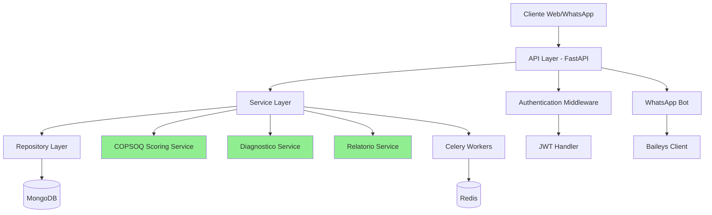
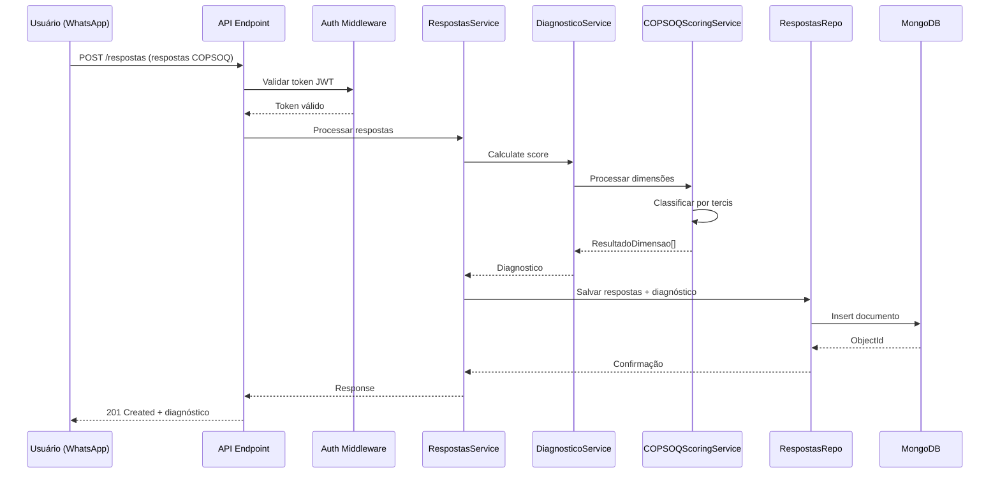

# Arquitetura do Backend LuzIA

> **Voltar para:** [📚 Documentação](../README.md) | [📖 README Principal](../../README.md)

---

## 📐 Visão Geral

O backend do LuzIA é construído usando **FastAPI** com arquitetura em camadas, seguindo princípios de Clean Architecture e Domain-Driven Design (DDD).

### Stack Tecnológico

| Tecnologia | Versão | Uso |
|------------|--------|-----|
| **Python** | 3.10+ | Linguagem principal |
| **FastAPI** | 0.100+ | Framework web assíncrono |
| **MongoDB** | 6.0+ | Banco de dados NoSQL |
| **Pydantic** | 2.0+ | Validação de dados |
| **Motor** | 3.0+ | Driver async para MongoDB |
| **JWT** | - | Autenticação |
| **Celery** | 5.0+ | Tarefas assíncronas |
| **Redis** | 7.0+ | Cache e message broker |
| **Baileys** | - | WhatsApp integration |

---

## 🏗️ Arquitetura em Camadas



### Camadas da Aplicação

#### 1. **API Layer** (`src/app/api/v1/`)

Responsável por:
- Receber requisições HTTP
- Validar entrada com Pydantic
- Chamar serviços apropriados
- Retornar respostas formatadas
- Tratamento de erros HTTP

**Endpoints principais:**
- `/auth` - Autenticação
- `/usuarios` - Gestão de usuários
- `/organizacoes` - Gestão de organizações
- `/questionarios` - CRUD de questionários
- `/respostas` - Submissão de respostas
- `/diagnosticos` - Consulta de diagnósticos
- `/relatorios` - Geração de relatórios

#### 2. **Service Layer** (`src/app/services/`)

Responsável por:
- Lógica de negócio
- Orquestração entre repositórios
- Cálculos complexos (COPSOQ scoring)
- Validações de domínio

**Serviços principais:**
- `COPSOQScoringService` - Cálculo de scores COPSOQ II
- `DiagnosticoService` - Processamento de diagnósticos
- `RelatorioService` - Geração de relatórios organizacionais

#### 3. **Repository Layer** (`src/app/repositories/`)

Responsável por:
- Acesso aos dados (CRUD)
- Queries ao MongoDB
- Abstrair detalhes do banco
- Conversão entre modelos DB e domínio

**Repositórios:**
- `UsuariosRepo`
- `OrganizacoesRepo`
- `QuestionariosRepo`
- `RespostasRepo`
- `DiagnosticosRepo`
- `RelatoriosRepo`

#### 4. **Models Layer** (`src/app/models/`)

Responsável por:
- Definição de schemas Pydantic
- Validação de dados
- Serialização/Deserialização
- Tipos de domínio

**Modelos principais:**
- `Usuario`, `Organizacao`, `Setor`
- `Questionario`, `Pergunta`, `Dominio`
- `Respostas`, `RespostaItem`
- `Diagnostico`, `DiagnosticoDimensao`
- `Relatorio`, `RelatorioDominio`, `RelatorioDimensao`

---

## 📦 Estrutura de Diretórios

```
backend/src/app/
├── __init__.py
├── main.py                    # Ponto de entrada da aplicação
│
├── api/                       # Camada de API
│   ├── __init__.py
│   ├── deps.py               # Dependências (auth, db)
│   └── v1/                   # Endpoints versionados
│       ├── __init__.py
│       ├── auth.py           # Login, register, tokens
│       ├── usuarios.py       # CRUD usuários
│       ├── organizacoes.py   # CRUD organizações
│       ├── questionarios.py  # CRUD questionários
│       ├── respostas.py      # Submissão de respostas
│       ├── diagnosticos.py   # Consulta diagnósticos
│       └── relatorios.py     # Geração de relatórios
│
├── core/                      # Configurações centrais
│   ├── __init__.py
│   ├── config.py             # Settings (Pydantic BaseSettings)
│   ├── database.py           # Conexão MongoDB
│   └── security.py           # JWT, hashing, auth
│
├── models/                    # Schemas Pydantic
│   ├── __init__.py
│   ├── base.py               # Modelos principais
│   └── auth.py               # Modelos de autenticação
│
├── repositories/              # Acesso a dados
│   ├── __init__.py
│   ├── base.py               # Repositório base
│   ├── usuarios.py
│   ├── organizacoes.py
│   ├── questionarios.py
│   ├── respostas.py
│   ├── diagnosticos.py
│   └── relatorios.py
│
├── services/                  # Lógica de negócio
│   ├── __init__.py
│   ├── copsoq_scoring_service.py  # ⭐ COPSOQ II
│   ├── diagnostico_service.py     # Processamento
│   └── relatorio_service.py       # Agregação
│
├── bot/                       # Integração WhatsApp
│   ├── __init__.py
│   ├── baileys_client.py     # Cliente Baileys
│   └── handlers.py           # Handlers de mensagens
│
└── workers/                   # Tarefas Celery
    ├── __init__.py
    └── tasks.py              # Tarefas assíncronas
```

---

## 🔄 Fluxo de Dados

### Exemplo: Submissão de Respostas COPSOQ



---

## 🔐 Autenticação e Autorização

### JWT Authentication

```python
# Geração de token
def create_access_token(data: dict) -> str:
    to_encode = data.copy()
    expire = datetime.utcnow() + timedelta(minutes=ACCESS_TOKEN_EXPIRE_MINUTES)
    to_encode.update({"exp": expire})
    return jwt.encode(to_encode, SECRET_KEY, algorithm=ALGORITHM)

# Verificação de token
async def get_current_user(token: str = Depends(oauth2_scheme)) -> Usuario:
    payload = jwt.decode(token, SECRET_KEY, algorithms=[ALGORITHM])
    user_id = payload.get("sub")
    return await usuarios_repo.get_by_id(user_id)
```

### Níveis de Acesso

| Role | Permissões |
|------|-----------|
| **admin_global** | Acesso total ao sistema |
| **admin_org** | Gestão da organização e setores |
| **gestor** | Visualização de relatórios do setor |
| **usuario** | Responder questionários e ver diagnóstico próprio |

---

## 📊 Padrões de Código

### Repository Pattern

```python
class BaseRepository:
    def __init__(self, collection_name: str):
        self.collection = db[collection_name]
    
    async def get_by_id(self, id: str) -> Optional[Dict]:
        return await self.collection.find_one({"_id": ObjectId(id)})
    
    async def create(self, data: Dict) -> str:
        result = await self.collection.insert_one(data)
        return str(result.inserted_id)
    
    async def update(self, id: str, data: Dict) -> bool:
        result = await self.collection.update_one(
            {"_id": ObjectId(id)},
            {"$set": data}
        )
        return result.modified_count > 0
```

### Service Pattern

```python
class DiagnosticoService:
    def calculate_score(
        self,
        respostas: List[RespostaItem],
        questionario: Dict[str, Any],
        perguntas: List[Dict[str, Any]]
    ) -> Diagnostico:
        # Lógica de negócio
        # ...
        return diagnostico
```

### Dependency Injection

```python
# Dependência de database
async def get_db():
    db = client[settings.MONGODB_DB_NAME]
    try:
        yield db
    finally:
        pass

# Dependência de autenticação
async def get_current_user(
    token: str = Depends(oauth2_scheme),
    db = Depends(get_db)
) -> Usuario:
    # ...
    return usuario

# Uso em endpoint
@router.get("/me")
async def read_users_me(
    current_user: Usuario = Depends(get_current_active_user)
):
    return current_user
```

---

## ⚡ Performance e Otimização

### Índices MongoDB

```python
# Índices principais criados
await db.usuarios.create_index("email", unique=True)
await db.questionarios.create_index("codigo", unique=True)
await db.respostas.create_index([("anonId", 1), ("idQuestionario", 1)])
await db.diagnosticos.create_index("anonId")
await db.organizacoes.create_index("nome")
```

### Caching com Redis

```python
# Cache de questionários
@cache(ttl=3600)  # 1 hora
async def get_questionario(codigo: str) -> Questionario:
    return await questionarios_repo.get_by_codigo(codigo)
```

### Async Processing

Operações pesadas são delegadas ao Celery:
- Geração de relatórios organizacionais
- Envio de notificações em massa
- Processamento de dados históricos

---

## 🧪 Testes

### Estrutura de Testes

```
tests/
├── unit/                      # Testes unitários
│   ├── test_copsoq_scoring.py
│   └── test_services.py
│
├── integration/               # Testes de integração
│   ├── test_auth_integration.py
│   ├── test_respostas_integration.py
│   └── test_diagnosticos_integration.py
│
└── conftest.py               # Fixtures compartilhadas
```

### Cobertura de Testes

- Services: 95%+
- Repositories: 90%+
- API Endpoints: 85%+

Veja [GUIA-TESTES.md](../guides/GUIA-TESTES.md) para detalhes.

---

## 📝 Logging e Monitoramento

### Configuração de Logs

```python
import logging

logging.basicConfig(
    level=logging.INFO,
    format='%(asctime)s - %(name)s - %(levelname)s - %(message)s'
)

logger = logging.getLogger(__name__)
```

### Métricas

- Tempo de resposta dos endpoints
- Taxa de sucesso/erro
- Uso de recursos (CPU, memória)
- Tamanho de payloads

---

## 🔗 Documentos Relacionados

- [⚡ Serviços Detalhados](SERVICOS.md)
- [🗄️ Modelos de Dados](MODELOS.md)
- [🔐 Autenticação](AUTENTICACAO.md)
- [🏢 Organizações](ORGANIZACOES.md)
- [🗄️ Banco de Dados](../DATABASE.md)
- [🔌 API Reference](../api/API.md)
- [✅ COPSOQ II](../guides/GUIA-COPSOQ-II.md)

---

**Última Atualização:** 2026-02-07
