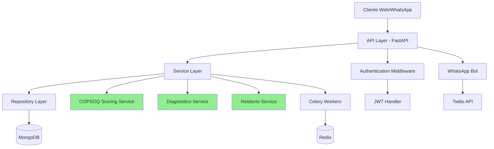

# Arquitetura do Backend LuzIA

> **Voltar para:** [📚 Documentação](../README.md) | [📖 README Principal](../../README.md)

---

## 📐 Visão Geral

O backend do LuzIA é construído usando **FastAPI** com arquitetura em camadas, seguindo princípios de Clean Architecture e Domain-Driven Design (DDD).

### Stack Tecnológico

| Tecnologia | Versão | Uso |
|------------|--------|-----|
| **Python** | 3.10+ | Linguagem principal |
| **FastAPI** | 0.100+ | Framework web assíncrono |
| **MongoDB** | 6.0+ | Banco de dados NoSQL |
| **Pydantic** | 2.0+ | Validação de dados |
| **Motor** | 3.0+ | Driver async para MongoDB |
| **JWT** | - | Autenticação |
| **Celery** | 5.0+ | Tarefas assíncronas |
| **Redis** | 7.0+ | Cache e message broker |
| **Twilio** | 8.0+ | WhatsApp integration |

---

## 🏗️ Arquitetura em Camadas



### Camadas da Aplicação

#### 1. **API Layer** (`src/app/api/v1/`)

Responsável por:
- Receber requisições HTTP
- Validar entrada com Pydantic
- Chamar serviços apropriados
- Retornar respostas formatadas
- Tratamento de erros HTTP

**Endpoints principais:**
- `/auth` - Autenticação (login, register, tokens JWT)
- `/organizacoes` - CRUD organizações
- `/setores` - CRUD setores
- `/questionarios` - Consulta de questionários
- `/respostas` - Submissão de respostas
- `/diagnosticos` - Consulta de diagnósticos
- `/relatorios` - Geração de relatórios
- `/dashboard` - Dashboard analítico com métricas

#### 2. **Service Layer** (`src/app/services/`)

Responsável por:
- Lógica de negócio
- Orquestração entre repositórios
- Cálculos complexos (COPSOQ scoring)
- Validações de domínio

**Serviços principais:**
- `COPSOQScoringService` - Cálculo de scores COPSOQ II
- `DiagnosticoService` - Processamento de diagnósticos
- `RelatorioService` - Geração de relatórios organizacionais
- `DashboardService` - Métricas e KPIs com cache Redis
- `TwilioContentService` - Templates de conteúdo WhatsApp

#### 3. **Repository Layer** (`src/app/repositories/`)

Responsável por:
- Acesso aos dados (CRUD)
- Queries ao MongoDB
- Abstrair detalhes do banco
- Conversão entre modelos DB e domínio

**Repositórios:**
- `BaseRepository` - CRUD genérico
- `UsuariosRepo`
- `OrganizacoesRepo`
- `QuestionariosRepo`
- `PerguntasRepo`
- `RespostasRepo`
- `DiagnosticosRepo`
- `RelatoriosRepo`
- `SetoresRepo`

#### 4. **Models Layer** (`src/app/models/`)

Responsável por:
- Definição de schemas Pydantic
- Validação de dados
- Serialização/Deserialização
- Tipos de domínio

**Modelos principais:**
- `Usuario`, `Organizacao`, `Setor`
- `Questionario`, `Pergunta`, `Dominio`
- `Respostas`, `RespostaItem`
- `Diagnostico`, `DiagnosticoDimensao`
- `Relatorio`, `RelatorioDominio`, `RelatorioDimensao`

---

## 📦 Estrutura de Diretórios

```
backend/src/app/
├── __init__.py
├── main.py                        # Ponto de entrada da aplicação
│
├── api/                           # Camada de API
│   └── v1/                       # Endpoints versionados
│       ├── __init__.py
│       ├── auth.py               # Login, register, tokens
│       ├── organizacoes.py       # CRUD organizações
│       ├── questionarios.py      # CRUD questionários
│       ├── respostas.py          # Submissão de respostas
│       ├── diagnosticos.py       # Consulta diagnósticos
│       ├── relatorios.py         # Geração de relatórios
│       └── dashboard.py          # Dashboard analítico
│
├── core/                          # Configurações centrais
│   ├── __init__.py
│   ├── config.py                 # Settings (Pydantic BaseSettings)
│   ├── database.py               # Conexão MongoDB (Motor async)
│   ├── security.py               # JWT, hashing, auth
│   ├── cache.py                  # Cache Redis (TTL configurável)
│   └── validators.py            # Validadores de domínio (CNPJ, telefone)
│
├── models/                        # Schemas Pydantic
│   ├── __init__.py
│   ├── base.py                   # Modelos principais
│   └── dashboard.py              # Modelos de dashboard
│
├── repositories/                  # Acesso a dados
│   ├── __init__.py
│   ├── base_repository.py        # Repositório base (CRUD genérico)
│   ├── usuarios.py
│   ├── organizacoes.py
│   ├── questionarios.py
│   ├── perguntas.py
│   ├── respostas.py
│   ├── diagnosticos.py
│   ├── relatorios.py
│   └── setores.py
│
├── services/                      # Lógica de negócio
│   ├── copsoq_scoring_service.py      # ⭐ COPSOQ II scoring
│   ├── diagnostico_service.py         # Processamento de diagnósticos
│   ├── relatorio_service.py           # Agregação organizacional
│   ├── dashboard_service.py           # Métricas e KPIs
│   └── twilio_content_service.py      # Templates WhatsApp
│
├── bot/                           # Integração WhatsApp (Twilio)
│   ├── endpoints.py              # Webhook Twilio
│   ├── flow.py                   # Fluxo conversacional do bot
│   └── parsers.py                # Parsing de mensagens
│
└── workers/                       # Tarefas Celery
    ├── __init__.py
    ├── celery_app.py             # Configuração Celery
    ├── diagnostico_tasks.py      # Tasks de diagnóstico
    └── relatorio_tasks.py        # Tasks de relatório
```

---

## 🔄 Fluxo de Dados

### Exemplo: Submissão de Respostas COPSOQ

```mermaid
sequenceDiagram
    participant U as Usuário (WhatsApp)
    participant API as API Endpoint
    participant Auth as Auth Middleware
    participant RS as RespostasService
    participant DS as DiagnosticoService
    participant CS as COPSOQScoringService
    participant Repo as RespostasRepo
    participant DB as MongoDB

    U->>API: POST /respostas (respostas COPSOQ)
    API->>Auth: Validar token JWT
    Auth-->>API: Token válido
    API->>RS: Processar respostas
    RS->>DS: Calculate score
    DS->>CS: Processar dimensões
    CS->>CS: Classificar por tercis
    CS-->>DS: ResultadoDimensao[]
    DS-->>RS: Diagnostico
    RS->>Repo: Salvar respostas + diagnóstico
    Repo->>DB: Insert documento
    DB-->>Repo: ObjectId
    Repo-->>RS: Confirmação
    RS-->>API: Response
    API-->>U: 201 Created + diagnóstico
```



---

## 🔐 Autenticação e Autorização

### JWT Authentication

```python
# Geração de token (core/security.py)
def create_access_token(data: dict, expires_delta: timedelta = None) -> str:
    to_encode = data.copy()
    expire = datetime.now(timezone.utc) + (expires_delta or timedelta(minutes=11520))
    to_encode.update({
        "exp": expire,
        "iat": datetime.now(timezone.utc),
        "jti": str(uuid.uuid4()),  # ID único por token
    })
    return jwt.encode(to_encode, SECRET_KEY, algorithm="HS256")

# Verificação de token (core/security.py)
async def get_current_user(token: str = Depends(oauth2_scheme)) -> TokenData:
    payload = jwt.decode(token, SECRET_KEY, algorithms=["HS256"])
    email = payload.get("sub")
    return TokenData(sub=email, email=email, jti=payload.get("jti"))
```

### Níveis de Acesso

| Role | Permissões |
|------|-----------|
| **admin_global** | Acesso total ao sistema |
| **admin_org** | Gestão da organização e setores |
| **gestor** | Visualização de relatórios do setor |
| **usuario** | Responder questionários e ver diagnóstico próprio |

---

## 📊 Padrões de Código

### Repository Pattern

```python
class BaseRepository:
    def __init__(self, collection_name: str):
        self.collection = db[collection_name]
    
    async def get_by_id(self, id: str) -> Optional[Dict]:
        return await self.collection.find_one({"_id": ObjectId(id)})
    
    async def create(self, data: Dict) -> str:
        result = await self.collection.insert_one(data)
        return str(result.inserted_id)
    
    async def update(self, id: str, data: Dict) -> bool:
        result = await self.collection.update_one(
            {"_id": ObjectId(id)},
            {"$set": data}
        )
        return result.modified_count > 0
```

### Service Pattern

```python
class DiagnosticoService:
    def calculate_score(
        self,
        respostas: List[RespostaItem],
        questionario: Dict[str, Any],
        perguntas: List[Dict[str, Any]]
    ) -> Diagnostico:
        # Lógica de negócio
        # ...
        return diagnostico
```

### Dependency Injection

```python
# Cadeia de dependências (api/deps.py)

# 1. Extrai TokenData do header Authorization
async def get_current_user(
    token_data: TokenData = Depends(get_token_user),  # core/security.py
) -> Usuario:
    user_dict = await user_repo.find_by_email(token_data.email)
    return Usuario(**user_dict)

# 2. Garante que status é ativo (em andamento ou finalizado)
async def get_current_active_user(
    current_user: Usuario = Depends(get_current_user),
) -> Usuario:
    if not is_active_user_status(current_user.status):
        raise HTTPException(status_code=400, detail="Inactive user")
    return current_user

# 3. Garante que é admin (metadata.is_admin == True)
async def get_current_admin_user(
    current_user: Usuario = Depends(get_current_active_user),
) -> Usuario:
    if not current_user.metadata.get("is_admin"):
        raise HTTPException(status_code=403, detail="Not enough privileges")
    return current_user

# Uso em endpoint
@router.get("/me")
async def read_users_me(
    current_user: Usuario = Depends(get_current_active_user)
):
    return current_user
```

---

## ⚡ Performance e Otimização

### Índices MongoDB

```python
# Índices principais criados
await db.usuarios.create_index("telefone", unique=True)
await db.usuarios.create_index("anonId", unique=True)
await db.questionarios.create_index("codigo", unique=True)
await db.respostas.create_index([("anonId", 1), ("idQuestionario", 1)], unique=True)
await db.diagnosticos.create_index("anonId")
await db.organizacoes.create_index("cnpj", unique=True)
await db.perguntas.create_index("idPergunta", unique=True)
```

### Caching com Redis

```python
# Cache de questionários
@cache(ttl=3600)  # 1 hora
async def get_questionario(codigo: str) -> Questionario:
    return await questionarios_repo.get_by_codigo(codigo)
```

### Async Processing

Operações pesadas são delegadas ao Celery:
- Geração de relatórios organizacionais
- Envio de notificações em massa
- Processamento de dados históricos

---

## 🧪 Testes

### Estrutura de Testes

```
tests/
├── services/                  # Testes de serviços
│   ├── test_copsoq_scoring_service.py
│   ├── test_diagnostico_service.py
│   └── test_relatorio_service.py
│
├── integration/               # Testes de integração
│   ├── test_copsoq_v3_migration.py
│   ├── test_diagnosticos_integration.py
│   ├── test_organizacoes_integration.py
│   ├── test_questionarios_integration.py
│   ├── test_repositories_integration.py
│   └── test_respostas_integration.py
│
├── unit/                      # Testes unitários
│
└── conftest.py               # Fixtures compartilhadas
```

### Cobertura de Testes

- Services: 95%+
- Repositories: 90%+
- API Endpoints: 85%+

Veja [GUIA-TESTES.md](../guides/GUIA-TESTES.md) para detalhes.

---

## 📝 Logging e Monitoramento

### Configuração de Logs

```python
import logging

logging.basicConfig(
    level=logging.INFO,
    format='%(asctime)s - %(name)s - %(levelname)s - %(message)s'
)

logger = logging.getLogger(__name__)
```

### Métricas

- Tempo de resposta dos endpoints
- Taxa de sucesso/erro
- Uso de recursos (CPU, memória)
- Tamanho de payloads

---

## 🔗 Documentos Relacionados

- [⚡ Serviços Detalhados](SERVICOS.md)
- [🗄️ Modelos de Dados](MODELOS.md)
- [🔐 Autenticação](AUTENTICACAO.md)
- [🏢 Organizações](ORGANIZACOES.md)
- [🗄️ Banco de Dados](../infra/DATABASE.md)
- [🔌 API Reference](../api/API.md)
- [✅ COPSOQ II](../guides/GUIA-COPSOQ-II.md)

---

**Última Atualização:** 2026-02-16
