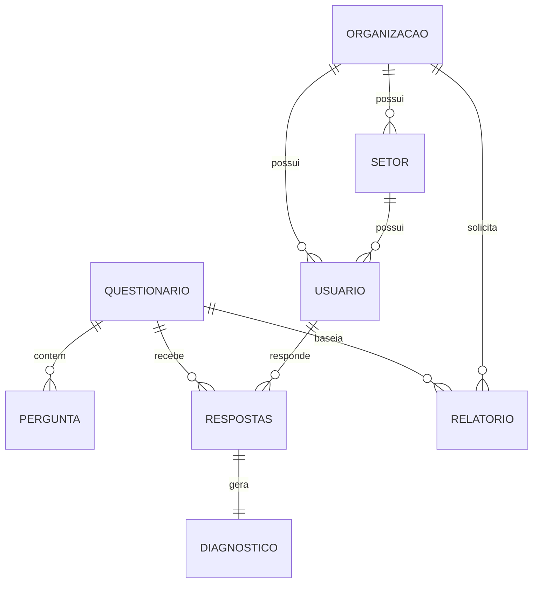

# Modelos de Dados do LuzIA

> **Voltar para:** [📚 Documentação](../README.md) | [🏛️ Arquitetura](ARQUITETURA.md)

---

## 📋 Visão Geral

Os modelos de dados do LuzIA são definidos usando **Pydantic v2**, garantindo validação em runtime e documentação automática via FastAPI.

**Arquivos:**
- [`backend/src/app/models/base.py`](../../backend/src/app/models/base.py) — Modelos de domínio
- [`backend/src/app/models/dashboard.py`](../../backend/src/app/models/dashboard.py) — Modelos de dashboard

---

## 🎯 Enums e Funções de Status

### StatusEnum

```python
class StatusEnum(str, Enum):
    FINALIZADO = "finalizado"
    EM_ANDAMENTO = "em andamento"
    NAO_INICIADO = "não iniciado"
```

> **Nota:** O sistema suporta aliases de status (ex: `"em_andamento"` e `"em andamento"` ambos são aceitos). A normalização é feita pela função `normalize_user_status()`.

### Funções Auxiliares de Status

```python
# Normaliza qualquer formato de status para o canônico
normalize_user_status("em_andamento")  # → "em andamento"

# Retorna lista de valores equivalentes para queries
user_status_values(StatusEnum.EM_ANDAMENTO)  # → ["em andamento", "em_andamento"]

# Verifica se é status "ativo" (em andamento ou finalizado)
is_active_user_status("finalizado")  # → True

# Verifica se está em andamento
is_in_progress_user_status("em andamento")  # → True
```

### ClassificacaoTercil

```python
class ClassificacaoTercil(str, Enum):
    FAVORAVEL = "favoravel"        # 🟢 Verde (média ≤ 2.33)
    INTERMEDIARIO = "intermediario" # 🟡 Amarelo (2.33 < média < 3.67)
    RISCO = "risco"                # 🔴 Vermelho (média ≥ 3.67)
```

> Definido em `copsoq_scoring_service.py` e importado pelos modelos.

---

## 🏢 Organização e Usuários

### Organizacao

```python
class Organizacao(BaseModel):
    cnpj: str                    # CNPJ validado (dígitos verificadores)
    nome: str                    # Razão social
    codigo: Optional[str] = None # Código identificador

    @field_validator("cnpj")
    def validate_cnpj(cls, value):
        # Remove formatação e valida dígitos verificadores
        # Usa validar_cnpj() de core/validators.py
```

### Setor

```python
class Setor(BaseModel):
    idOrganizacao: Any           # ObjectId da organização
    nome: str                    # Nome do setor
    descricao: Optional[str]     # Descrição opcional
```

### UserState

```python
class UserState(BaseModel):
    """Estado do usuário durante o fluxo do chatbot"""
    idQuestionario: Optional[str] = None
    indicePergunta: int = 0
    statusChat: str = "INATIVO"  # INATIVO, EM_CURSO, FINALIZADO
    dataInicio: Optional[datetime] = None
```

### Usuario

```python
class Usuario(BaseModel):
    telefone: str                # WhatsApp E.164 (validado: +XXXXXXXXXXXX)
    email: Optional[str] = None  # Email opcional (validado, normalizado lowercase)
    password_hash: Optional[str] = None  # Hash PBKDF2-SHA256
    idOrganizacao: Any           # ObjectId da organização
    idSetor: Optional[Any] = None # ObjectId do setor (opcional)
    numeroUnidade: Optional[str] = None  # Número/unidade do colaborador
    status: StatusEnum = StatusEnum.NAO_INICIADO  # finalizado/em andamento/não iniciado
    respondido: bool = False     # Se já respondeu questionário
    anonId: str                  # ID anônimo para LGPD
    dataCadastro: datetime       # default: datetime.utcnow()
    metadata: Dict[str, Any]     # Dados adicionais (default: {})

    # Validadores:
    # - telefone: formato E.164
    # - email: regex + lowercase
    # - status: normalização automática via normalize_user_status()
```

---

## 📝 COPSOQ II - Questionários e Perguntas

### Dominio

```python
class Dominio(BaseModel):
    codigo: str                  # EL, OTC, RSL, ITI, VLT, SBE, CO, PER
    nome: str                    # "Exigências Laborais"
    ordem: int
    descricao: Optional[str]
```

### OpcaoResposta

```python
class OpcaoResposta(BaseModel):
    valor: int                    # 0-4 ou 1-5
    texto: str                    # "Sempre", "Frequentemente", etc.
```

### SubPergunta

```python
class SubPergunta(BaseModel):
    """Sub-pergunta condicional (usada em Comportamentos Ofensivos)"""
    condicao: str                 # ex: "valor > 0"
    texto: str
    tipoResposta: str             # ex: "multipla_escolha"
    opcoes: List[str]
```

### Pergunta

```python
class Pergunta(BaseModel):
    idQuestionario: Any
    codigoDominio: Optional[str]   # Código do domínio (EL, OTC, etc.)
    dominio: str                    # Nome do domínio
    dimensao: str                   # Nome da dimensão
    idPergunta: str                 # Código único (ex: EL_EQ_01A)
    texto: str
    tipoEscala: str = "frequencia"  # frequencia, intensidade, satisfacao, etc.
    sinal: str = "risco"            # risco ou protecao
    itemInvertido: bool = False
    ordem: Optional[int] = None
    opcoesResposta: Optional[List[OpcaoResposta]] = None
    subPergunta: Optional[SubPergunta] = None
    ativo: bool = True

    # Campos legados para compatibilidade
    tipo: Optional[str] = None      # DEPRECATED: use tipoEscala
    escala: Optional[int] = 5       # DEPRECATED: use opcoesResposta
```

### Questionario

```python
class Questionario(BaseModel):
    nome: str
    codigo: Optional[str]        # COPSOQ_CURTA_BR ou COPSOQ_MEDIA_PT
    versao: str
    tipo: str = "psicossocial"
    idioma: str = "pt-BR"        # pt-BR ou pt-PT
    descricao: str
    dominios: Union[List[str], List[Dominio]]  # Aceita formato antigo ou novo
    escalasPossiveis: Optional[List[str]] = None
    escala: Optional[str] = None  # DEPRECATED
    totalPerguntas: int
    ativo: bool = True
```

---

## 📊 Respostas e Diagnósticos

### RespostaItem

```python
class RespostaItem(BaseModel):
    valor: Optional[Union[int, List[int]]] = None  # 0-5 (int ou lista)
    valorTexto: Optional[str] = None                # Resposta textual (1-1000 chars)
    idPergunta: str

    # Validação: deve ter 'valor' ou 'valorTexto'
    # Se int: 0 ≤ valor ≤ 5
    # Se lista: todos inteiros entre 0 e 5, não vazia
```

### Respostas

```python
class Respostas(BaseModel):
    anonId: str                   # ID anônimo do usuário
    idQuestionario: Any
    data: datetime                # default: datetime.utcnow()
    respostas: List[RespostaItem]
```

### DiagnosticoDimensao

```python
class DiagnosticoDimensao(BaseModel):
    dominio: str
    codigoDominio: Optional[str] = None
    dimensao: str
    pontuacao: float              # Média da dimensão
    classificacao: ClassificacaoTercil  # Enum
    sinal: str = "risco"          # protecao ou risco
    total_itens: int = 0
    itens_respondidos: int = 0
    itens: Optional[List[Dict[str, Any]]] = None  # Detalhes dos itens
```

### Diagnostico

```python
class Diagnostico(BaseModel):
    anonId: str
    idQuestionario: Any
    resultadoGlobal: str          # favoravel/intermediario/risco
    pontuacaoGlobal: float
    dimensoes: List[DiagnosticoDimensao]
    dataAnalise: datetime         # default: datetime.utcnow()
```

---

## 📑 Relatórios

### RelatorioMetricas

```python
class RelatorioMetricas(BaseModel):
    mediaRiscoGlobal: float       # 0-4
    indiceProtecao: float         # 0-100%
    totalRespondentes: int
```

### RelatorioDimensao

```python
class RelatorioDimensao(BaseModel):
    dimensao: str
    media: float                  # Média organizacional
    distribuicao: Dict[str, int]  # {favoravel: 15, intermediario: 8, risco: 2}
    classificacao: ClassificacaoTercil
    sinal: str
```

### RelatorioDominio

```python
class RelatorioDominio(BaseModel):
    codigo: str                   # EL, OTC, etc.
    nome: str
    dimensoes: List[RelatorioDimensao]
    media_dominio: float
    classificacao_predominante: ClassificacaoTercil
```

### Relatorio

```python
class Relatorio(BaseModel):
    idQuestionario: Any
    idOrganizacao: Optional[Any] = None
    idSetor: Optional[Any] = None
    tipoRelatorio: str            # organizacional, setorial, individual
    geradoPor: str                # Email do gerador
    dataGeracao: datetime         # default: datetime.utcnow()
    metricas: RelatorioMetricas
    dominios: List[RelatorioDominio]
    recomendacoes: List[str] = []  # default: []
    observacoes: Optional[str] = None
```

---

## 📊 Modelos de Dashboard

**Arquivo:** [`backend/src/app/models/dashboard.py`](../../backend/src/app/models/dashboard.py)

Modelos específicos para o dashboard executivo:

| Modelo | Descrição |
|--------|-----------|
| `DashboardOverview` | Visão geral (totais, alertas, taxa de conclusão) |
| `OrganizacaoDashboard` | Resumo por organização |
| `OrganizacaoDetalhada` | Detalhes com setores e questionários |
| `SetorDashboard` | Resumo por setor |
| `SetorDetalhado` | Detalhes com usuários e progresso |
| `UsuarioAtivo` | Usuário com progresso e última atividade |
| `ProgressoUsuario` | Progresso de questionário |
| `QuestionarioStatus` | Status de conclusão |
| `QuestionarioMetricas` | Métricas e dimensões críticas |
| `AlertaDashboard` | Alertas (tipo, mensagem, severidade) |
| `DimensaoCritica` | Dimensão com contagem de risco |

---

## 🔗 Relacionamentos



---

## 🔗 Documentos Relacionados

- [⚡ Serviços](SERVICOS.md)
- [🏛️ Arquitetura](ARQUITETURA.md)
- [🗄️ Banco de Dados](../infra/DATABASE.md)

---

**Última Atualização:** 2026-02-16
