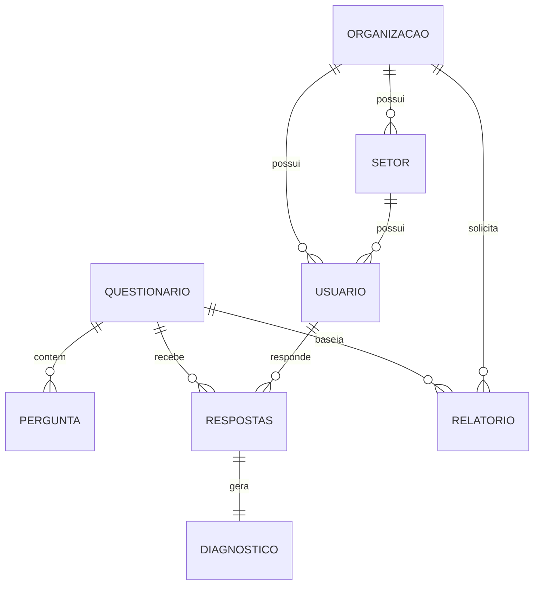

# Modelos de Dados do LuzIA

> **Voltar para:** [📚 Documentação](../README.md) | [🏛️ Arquitetura](ARQUITETURA.md)

---

## 📋 Visão Geral

Os modelos de dados do LuzIA são definidos usando **Pydantic v2**, garantindo validação em runtime e documentação automática via FastAPI.

**Arquivo Principal:** [`backend/src/app/models/base.py`](../../backend/src/app/models/base.py)

---

## 🏢 Organização e Usuários

### Organizacao

```python
class Organizacao(BaseModel):
    cnpj: str                    # CNPJ da empresa
    nome: str                    # Razão social
```

### Setor

```python
class Setor(BaseModel):
    idOrganizacao: Any           # ObjectId da organização
    nome: str                    # Nome do setor
    descricao: Optional[str]     # Descrição opcional
```

### Usuario

```python
class Usuario(BaseModel):
    telefone: str                # WhatsApp (com código do país)
    idOrganizacao: Any           # ObjectId da organização
    idSetor: Optional[Any]       # ObjectId do setor (opcional)
    status: StatusEnum           # ativo/inativo/aguardando_confirmacao
    respondido: bool            # Se já respondeu questionário
    anonId: str                  # ID anônimo para LGPD
    dataCadastro: datetime
    metadata: Dict[str, Any]     # Dados adicionais
```

---

## 📝 COPSOQ II - Questionários

### Questionario

```python
class Questionario(BaseModel):
    nome: str
    codigo: Optional[str]        # COPSOQ_CURTA_BR ou COPSOQ_MEDIA_PT
    versao: str
    tipo: str = "psicossocial"
    idioma: str                  # pt-BR ou pt-PT
    descricao: str
    dominios: List[Dominio]      # Lista de domínios
    totalPerguntas: int
    ativo: bool = True
```

### Dominio

```python
class Dominio(BaseModel):
    codigo: str                  # EL, OTC, RSL, ITI, VLT, SBE, CO, PER
    nome: str                    # "Exigências Laborais"
    ordem: int
    descricao: Optional[str]
```

### Pergunta

```python
class Pergunta(BaseModel):
    idQuestionario: Any
    codigoDominio: Optional[str]   # Código do domínio
    dominio: str                    # Nome do domínio
    dimensao: str                   # Nome da dimensão
    idPergunta: str                 # Código único (ex: EL_EQ_01A)
    texto: str
    tipoEscala: str                 # frequencia, intensidade, etc.
    sinal: str                      # risco ou protecao
    itemInvertido: bool = False
    ordem: Optional[int]
    opcoesResposta: List[OpcaoResposta]
```

### OpcaoResposta

```python
class OpcaoResposta(BaseModel):
    valor: int                    # 0-4 ou 1-5
    texto: str                    # "Sempre", "Frequentemente", etc.
```

---

## 📊 Respostas e Diagnósticos

### Respostas

```python
class Respostas(BaseModel):
    anonId: str                   # ID anônimo do usuário
    idQuestionario: Any
    data: datetime
    respostas: List[RespostaItem]
```

### RespostaItem

```python
class RespostaItem(BaseModel):
    valor: int                    # 0-4 (validado)
    idPergunta: str               # Referência à pergunta
```

### Diagnostico

```python
class Diagnostico(BaseModel):
    anonId: str
    idQuestionario: Any
    resultadoGlobal: str          # favoravel/intermediario/risco
    pontuacaoGlobal: float        # 0-4
    dimensoes: List[DiagnosticoDimensao]
    dataAnalise: datetime
```

### DiagnosticoDimensao

```python
class DiagnosticoDimensao(BaseModel):
    dominio: str
    codigoDominio: Optional[str]
    dimensao: str
    pontuacao: float              # Média da dimensão
    classificacao: ClassificacaoTercil  # Enum
    sinal: str                    # protecao ou risco
    total_itens: int
    itens_respondidos: int
```

---

## 📑 Relatórios

### Relatorio

```python
class Relatorio(BaseModel):
    idQuestionario: Any
    idOrganizacao: Optional[Any]
    idSetor: Optional[Any]
    tipoRelatorio: str            # organizacional/setorial
    geradoPor: str                # Email do gerador
    dataGeracao: datetime
    metricas: RelatorioMetricas
    dominios: List[RelatorioDominio]
    recomendacoes: List[str]
    observacoes: Optional[str]
```

### RelatorioDominio

```python
class RelatorioDominio(BaseModel):
    codigo: str                   # EL, OTC, etc.
    nome: str
    dimensoes: List[RelatorioDimensao]
    media_dominio: float
    classificacao_predominante: ClassificacaoTercil
```

### RelatorioDimensao

```python
class RelatorioDimensao(BaseModel):
    dimensao: str
    media: float                  # Média organizacional
    distribuicao: Dict[str, int]  # {favoravel: 15, intermediario: 8, risco: 2}
    classificacao: ClassificacaoTercil
    sinal: str
```

### RelatorioMetricas

```python
class RelatorioMetricas(BaseModel):
    mediaRiscoGlobal: float       # 0-4
    indiceProtecao: float          # 0-100%
    totalRespondentes: int
```

---

## 🎯 Enums

### ClassificacaoTercil

```python
class ClassificacaoTercil(str, Enum):
    FAVORAVEL = "favoravel"        # Verde
    INTERMEDIARIO = "intermediario"  # Amarelo
    RISCO = "risco"                # Vermelho
```

### StatusEnum

```python
class StatusEnum(str, Enum):
    ATIVO = "ativo"
    INATIVO = "inativo"
    AGUARDANDO_CONFIRMACAO = "aguardando_confirmacao"
```

---

## 🔗 Relacionamentos



---

##  🔗 Documentos Relacionados

- [⚡ Serviços](SERVICOS.md)
- [🏛️ Arquitetura](ARQUITETURA.md)
- [🗄️ Banco de Dados](../DATABASE.md)

---

**Última Atualização:** 2026-02-07
