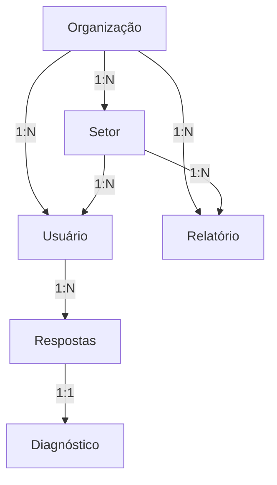
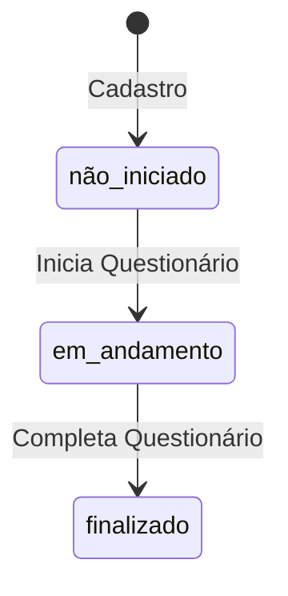
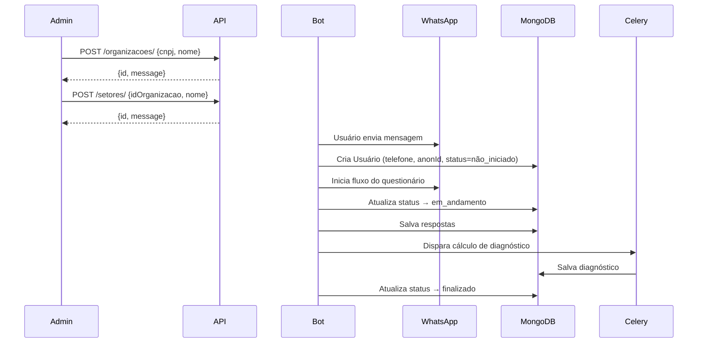

# Organizações, Setores e Usuários

> **Voltar para:** [📚 Documentação](../README.md) | [🏛️ Arquitetura](ARQUITETURA.md)

---

## 📊 Estrutura Hierárquica



---

## 🏢 Organização

```python
class Organizacao(BaseModel):
    cnpj: str              # CNPJ com dígitos verificadores validados
    nome: str              # Razão social (obrigatório)
    codigo: Optional[str]  # Código identificador (opcional)
```

### Validação de CNPJ

O CNPJ é validado em duas etapas:
1. **Limpeza:** Remove caracteres não-numéricos via `re.sub(r"\D", "", value)`
2. **Verificação:** Valida dígitos verificadores via `validar_cnpj()` de `core/validators.py`

```python
# core/validators.py
def validar_cnpj(cnpj: str) -> bool:
    # Rejeita CNPJs com todos os dígitos iguais
    # Calcula primeiro e segundo dígitos verificadores
    # Retorna True se os dígitos calculados conferem
```

### Regras de Negócio
- CNPJ é **unique** no banco de dados
- Remoção bloqueada se houver setores ou usuários vinculados
- CRUD completo disponível via `/api/v1/organizacoes`

---

## 🏗 Setor

```python
class Setor(BaseModel):
    idOrganizacao: Any            # ObjectId da organização (obrigatório)
    nome: str                     # Nome do setor (obrigatório)
    descricao: Optional[str]      # Descrição (opcional)
```

### Regras de Negócio
- Nome do setor é **único por organização** (verificado na criação e atualização)
- Remoção bloqueada se houver usuários vinculados ao setor
- Existência da organização é verificada antes de criar/atualizar setor

---

## 👤 Usuário

```python
class Usuario(BaseModel):
    telefone: str                          # E.164: +XXXXXXXXXXXX (validado)
    email: Optional[str] = None            # Normalizado para lowercase
    password_hash: Optional[str] = None    # PBKDF2-SHA256
    idOrganizacao: Any                     # ObjectId da organização
    idSetor: Optional[Any] = None          # ObjectId do setor
    numeroUnidade: Optional[str] = None    # Número/unidade do colaborador
    status: StatusEnum = NAO_INICIADO      # finalizado/em andamento/não iniciado
    respondido: bool = False               # Se já respondeu ao questionário
    anonId: str                            # ID anônimo (LGPD)
    dataCadastro: datetime                 # Data de registro
    metadata: Dict[str, Any] = {}          # Dados adicionais (is_admin, etc.)
```

### Estados do Usuário



| Status | Código | `is_active` |
|--------|--------|-------------|
| Não Iniciado | `"não iniciado"` | ❌ |
| Em Andamento | `"em andamento"` | ✅ |
| Finalizado | `"finalizado"` | ✅ |

> O sistema aceita aliases: `"em_andamento"` ↔ `"em andamento"`, `"nao_iniciado"` ↔ `"não iniciado"`

### UserState (Estado do Chatbot)

```python
class UserState(BaseModel):
    idQuestionario: Optional[str] = None
    indicePergunta: int = 0
    statusChat: str = "INATIVO"   # INATIVO, EM_CURSO, FINALIZADO
    dataInicio: Optional[datetime] = None
```

---

## 🔄 Fluxo de Cadastro



---

## 📊 Geração de Relatórios

Relatórios podem ser gerados em dois escopos:

| Tipo | Escopo | Dados Agregados |
|------|--------|-----------------|
| **Organizacional** | Toda a organização | Todos os diagnósticos da org |
| **Setorial** | Setor específico | Diagnósticos apenas do setor |

O processo filtra apenas o diagnóstico **mais recente** de cada usuário para evitar duplicações.

---

## 🔗 Documentos Relacionados

- [🔐 Autenticação](AUTENTICACAO.md)
- [📦 Modelos](MODELOS.md)
- [🔌 API](../api/API.md)
- [📱 WhatsApp](../integracoes/WHATSAPP.md)

---

**Última Atualização:** 2026-02-17
