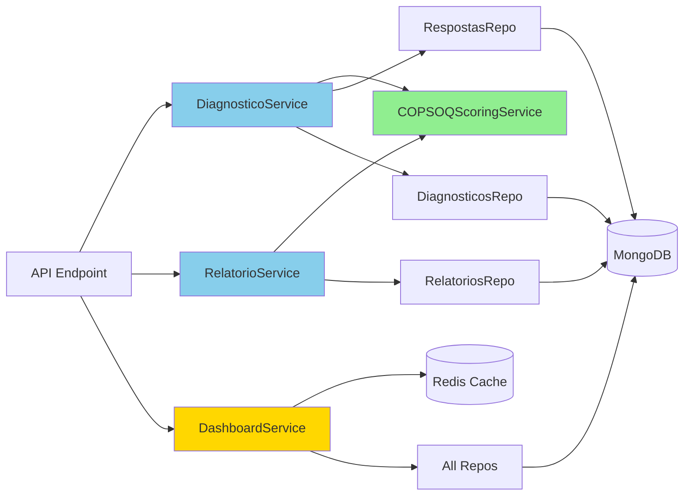

# Serviços do Backend LuzIA

> **Voltar para:** [📚 Documentação](../README.md) | [🏛️ Arquitetura](ARQUITETURA.md)

---

## 📋 Visão Geral

A camada de serviços (`src/app/services/`) contém toda a lógica de negócio do LuzIA. Os serviços orquestram operações complexas, realizam cálculos especializados e coordenam interações entre repositórios.

---

## ⭐ COPSOQ Scoring Service

**Arquivo:** [`backend/src/app/services/copsoq_scoring_service.py`](../../backend/src/app/services/copsoq_scoring_service.py)

### Responsabilidades

- Implementação completa da metodologia COPSOQ II
- Classificação por tercis (favorável/intermediário/risco)
- Diferenciação entre dimensões de proteção e risco
- Inversão de itens específicos
- Suporte a múltiplas versões (curta BR, média PT)

### API Principal

```python
class COPSOQScoringService:
    # Limites de tercis
    LIMITE_INFERIOR = 2.33
    LIMITE_SUPERIOR = 3.67
    
    def classificar_tercil(
        self,
        media: float,
        dimensao: str
    ) -> ClassificacaoTercil:
        """Classifica média em tercil baseado na dimensão."""
        
    def processar_dimensao(
        self,
        dimensao: str,
        dominio: str,
        respostas: List[Dict[str, int]],
        codigo_questionario: str,
        escala_max: int = 5
    ) -> ResultadoDimensao:
        """Processa uma dimensão completa e retorna resultado."""
        
    def inverter_valor(
        self,
        valor: int,
        escala_max: int = 5
    ) -> int:
        """Inverte valor da escala (apenas itens específicos)."""
        
    def eh_dimensao_protecao(
        self,
        dimensao: str
    ) -> bool:
        """Verifica se dimensão é de proteção (vs risco)."""
```

### Exemplo de Uso

```python
from app.services.copsoq_scoring_service import copsoq_scoring_service

# Processar dimensão
resultado = copsoq_scoring_service.processar_dimensao(
    dimensao="Exigências quantitativas",
    dominio="Exigências Laborais",
    respostas=[
        {"id_pergunta": "EL_EQ_01A", "valor": 3},
        {"id_pergunta": "EL_EQ_01B", "valor": 2},
        {"id_pergunta": "EL_EQ_01C", "valor": 4}
    ],
    codigo_questionario="COPSOQ_CURTA_BR",
    escala_max=4
)

print(f"Média: {resultado.media}")                    # 3.0
print(f"Classificação: {resultado.classificacao}")   # intermediario
print(f"Itens respondidos: {resultado.itens_respondidos}/3")
```

### Dimensões de Proteção

```python
DIMENSOES_PROTECAO = {
    "Influência no trabalho",
    "Possibilidades de desenvolvimento",
    "Variação do trabalho",
    "Significado do trabalho",
    "Compromisso face ao local de trabalho",
    "Previsibilidade",
    "Transparência do papel laboral desenvolvido",
    "Recompensas",
    "Apoio social de colegas",
    "Apoio social de superiores",
    "Comunidade social no trabalho",
    "Qualidade da liderança",
    "Justiça e respeito",
    "Auto-eficácia",
    "Confiança horizontal",
    "Confiança vertical",
}
```

📖 **Documentação Completa:** [GUIA-COPSOQ-II.md](../guides/GUIA-COPSOQ-II.md)

---

## 📊 Diagnóstico Service

**Arquivo:** [`backend/src/app/services/diagnostico_service.py`](../../backend/src/app/services/diagnostico_service.py)

### Responsabilidades

- Processar respostas de questionários
- Calcular scores por dimensão
- Agregar scores por domínio
- Gerar diagnóstico individual
- Calcular resultado global

### API Principal

```python
class DiagnosticoService:
    def calculate_score(
        self,
        respostas: List[RespostaItem],
        questionario: Dict[str, Any],
        perguntas: List[Dict[str, Any]]
    ) -> Diagnostico:
        """Calcula score completo a partir das respostas."""
        
    def _detectar_escala_max(
        self,
        respostas: List[RespostaItem]
    ) -> int:
        """Detecta escala máxima (4 ou 5) das respostas."""
        
    def _resultado_global(
        self,
        dimensoes: List[DiagnosticoDimensao]
    ) -> Tuple[str, float]:
        """Calcula resultado global baseado em dimensões."""
```

### Lógica de Cálculo

#### 1. Detecção de Questionário COPSOQ

```python
codigo_questionario = questionario.get("codigo") or ""
is_copsoq = codigo_questionario.startswith("COPSOQ_")
```

#### 2. Agrupamento por Dimensão

```python
# Agrupa respostas por (codigo_dominio, dominio, dimensao, sinal)
key = (
    p.get("codigoDominio") or p.get("dominio"),
    p.get("dominio"),
    p.get("dimensao"),
    p.get("sinal") or determinar_sinal(dimensao)
)
domain_scores[key].append({"id_pergunta": resp.idPergunta, "valor": resp.valor})
```

#### 3. Processamento de Cada Dimensão

```python
if is_copsoq:
    # Usa COPSOQScoringService
    resultado = copsoq_scoring_service.processar_dimensao(...)
    pontuacao = resultado.media
    classificacao = resultado.classificacao
else:
    # Cálculo genérico com tercis
    avg = sum(i["valor"] for i in items) / len(items)
    pontuacao = round(avg, 2)
    if avg <= 2.33:
        classificacao = ClassificacaoTercil.FAVORAVEL
    # ...
```

#### 4. Cálculo de Resultado Global

```python
# Baseado na distribuição de classificações
qtd_risco = sum(1 for d in dimensoes if d.classificacao == ClassificacaoTercil.RISCO)
qtd_favoravel = sum(1 for d in dimensoes if d.classificacao == ClassificacaoTercil.FAVORAVEL)

if qtd_risco / total >= 0.5:
    resultado = "risco"
elif qtd_favoravel / total >= 0.5:
    resultado = "favoravel"
else:
    resultado = "intermediario"
```

### Exemplo de Uso

```python
from app.services.diagnostico_service import DiagnosticoService

service = DiagnosticoService()

diagnostico = service.calculate_score(
    respostas=[RespostaItem(idPergunta="EL_EQ_01A", valor=3), ...],
    questionario={"_id": ObjectId(...), "codigo": "COPSOQ_CURTA_BR"},
    perguntas=[{...pergunta metadata...}]
)

print(f"Resultado Global: {diagnostico.resultadoGlobal}")  # "intermediario"
print(f"Pontuação Global: {diagnostico.pontuacaoGlobal}")   # 2.15
print(f"Dimensões: {len(diagnostico.dimensoes)}")          # 23
```

---

## 📑 Relatório Service

**Arquivo:** [`backend/src/app/services/relatorio_service.py`](../../backend/src/app/services/relatorio_service.py)

### Responsabilidades

- Agregar diagnósticos organizacionais
- Calcular médias por dimensão/domínio
- Gerar distribuição de tercis
- Calcular índice de proteção
- Gerar recomendações contextualizadas

### API Principal

```python
class RelatorioService:
    def generate_relatorio(
        self,
        diagnosticos: List[Dict[str, Any]],
        questionario_id: Any,
        tipo: str,
        org_id: Any = None,
        setor_id: Any = None,
        gerado_por: str = "system"
    ) -> Relatorio:
        """Gera relatório organizacional agregado."""
        
    def _gerar_recomendacoes(
        self,
        dominios: List[RelatorioDominio]
    ) -> List[str]:
        """Gera recomendações baseadas em dimensões em risco."""
        
    def _normalize_classificacao(
        self,
        valor: Any
    ) -> str:
        """Normaliza classificação para string."""
```

### Lógica de Agregação

#### 1. Agregação por Dimensão

```python
agregacao_dimensoes: Dict[tuple, Dict[str, Any]] = {}

for diag in diagnosticos:
    for d in diag["dimensoes"]:
        key = (codigo_dominio, dominio, dimensao, sinal)
        
        agregacao_dimensoes[key]["medias"].append(pontuacao)
        agregacao_dimensoes[key]["distribuicao"][classificacao] += 1
```

#### 2. Cálculo de Métricas por Dimensão

```python
media = sum(dados["medias"]) / len(dados["medias"])
classificacao_media = copsoq_scoring_service.classificar_tercil(media, dimensao)

dimensao = RelatorioDimensao(
    dimensao=dimensao,
    media=round(media, 2),
    distribuicao={
        "favoravel": dados["distribuicao"].get("favoravel", 0),
        "intermediario": dados["distribuicao"].get("intermediario", 0),
        "risco": dados["distribuicao"].get("risco", 0),
    },
    classificacao=classificacao_media,
    sinal=sinal
)
```

#### 3. Agregação por Domínio

```python
for (codigo, nome), dimensoes in dominios_map.items():
    media_dominio = sum(d.media for d in dimensoes) / len(dimensoes)
    
    # Classificação predominante (mais comum)
    predominante = max(
        [FAVORAVEL, INTERMEDIARIO, RISCO],
        key=lambda c: sum(1 for d in dimensoes if d.classificacao == c)
    )
    
    dominio = RelatorioDominio(
        codigo=codigo,
        nome=nome,
        dimensoes=dimensoes,
        media_dominio=round(media_dominio, 2),
        classificacao_predominante=predominante
    )
```

#### 4. Cálculo de Métricas Globais

```python
# Média de Risco Global
risco_ratio = (total_dim_risco / total_dim_classificadas) if total_dim_classificadas else 0
media_risco_global = round(risco_ratio * 4, 2)

# Índice de Proteção
indice_protecao = round(
    (total_dim_protecao_favoravel / total_dim_protecao) * 100, 2
) if total_dim_protecao else 0.0
```

### Recomendações Contextualizadas

```python
mapeamento = {
    "Exigências quantitativas": "Revisar distribuição de carga de trabalho e prioridades.",
    "Apoio social de superiores": "Implementar rotina de feedback e treinamento de liderança.",
    "Conflito trabalho-família": "Reavaliar políticas de jornada e flexibilidade.",
    "Burnout": "Criar plano de prevenção de esgotamento com acompanhamento periódico.",
    "Stress": "Fortalecer ações de gestão de estresse e pausas programadas.",
}

# Gera apenas recomendações para dimensões em risco
for dominio in dominios:
    for dim in dominio.dimensoes:
        if dim.classificacao == ClassificacaoTercil.RISCO:
            recomendacao = mapeamento.get(dim.dimensao, f"Priorizar '{dim.dimensao}'.")
            if recomendacao not in recomendacoes:
                recomendacoes.append(recomendacao)
```

### Exemplo de Uso

```python
from app.services.relatorio_service import RelatorioService

service = RelatorioService()

relatorio = service.generate_relatorio(
    diagnosticos=[{...diagnostico1...}, {...diagnostico2...}, ...],
    questionario_id=ObjectId(...),
    tipo="organizacional",
    org_id=ObjectId(...),
    gerado_por="admin@empresa.com"
)

print(f"Total Respondentes: {relatorio.metricas.totalRespondentes}")
print(f"Média Risco Global: {relatorio.metricas.mediaRiscoGlobal}")
print(f"Índice Proteção: {relatorio.metricas.indiceProtecao}%")
print(f"Domínios: {len(relatorio.dominios)}")
print(f"Recomendações: {relatorio.recomendacoes}")
```

---

## 📊 Dashboard Service

**Arquivo:** [`backend/src/app/services/dashboard_service.py`](../../backend/src/app/services/dashboard_service.py)

### Responsabilidades

- Agregação de métricas por organização, setor e questionário
- KPIs: taxa de conclusão, usuários ativos, alertas
- Cache Redis para dados de dashboard

### API Principal

```python
class DashboardService:
    async def get_overview() -> DashboardOverview
    async def list_organizacoes() -> List[OrganizacaoDashboard]
    async def get_organizacao_detalhada(org_id) -> OrganizacaoDetalhada
    async def list_setores(org_id=None) -> List[SetorDashboard]
    async def get_setor_detalhado(setor_id) -> SetorDetalhado
    async def list_usuarios_ativos(org_id=None, setor_id=None) -> List[UsuarioAtivo]
    async def get_usuario_progresso(user_id) -> ProgressoUsuario
    async def list_questionarios_status() -> List[QuestionarioStatus]
    async def get_questionario_metricas(q_id) -> QuestionarioMetricas
```

> Todas as rotas do dashboard requerem autenticação **Admin** via `Depends(get_current_admin_user)`.

---

## 📱 Twilio Content Service

**Arquivo:** [`backend/src/app/services/twilio_content_service.py`](../../backend/src/app/services/twilio_content_service.py)

### Responsabilidades

- Mapear `tipoEscala` de perguntas para Content Templates do Twilio
- Enviar mensagens interativas via WhatsApp (listas, botões)
- Fallback para texto simples quando template não configurado

### Mapeamento de Templates

| Tipo de Escala | Variável de Ambiente | Uso |
|---------------|---------------------|-----|
| `frequencia` | `TWILIO_TEMPLATE_FREQUENCIA` | Maioria das perguntas COPSOQ |
| `intensidade` | `TWILIO_TEMPLATE_INTENSIDADE` | Escalas de intensidade |
| `satisfacao` | `TWILIO_TEMPLATE_SATISFACAO` | Perguntas de satisfação |
| `conflito_tf` | `TWILIO_TEMPLATE_CONFLITO_TF` | Conflito trabalho-família |
| `saude_geral` | `TWILIO_TEMPLATE_SAUDE_GERAL` | Saúde e bem-estar |
| `comportamento_ofensivo` | `TWILIO_TEMPLATE_COMPORTAMENTO_OFENSIVO` | Comportamentos ofensivos |

---

## 🧪 Testes e Cobertura

Desde a versão 2.1.0, todos os serviços principais possuem testes unitários completos com alta cobertura.

### COPSOQScoringService

- **Arquivo de Teste:** [`backend/tests/services/test_copsoq_scoring_service.py`](../../backend/tests/services/test_copsoq_scoring_service.py)
- **Cobertura:** ~95%
- **Casos Testados:** 15+ cenários incluindo edge cases

**Principais testes:**
- Classificação por tercis científicos
- Cálculo correto de médias
- Inversão de itens (VLT_CV_03, VLT_CH_01)
- Agregação por domínios COPSOQ II
- Robustez com dados incompletos

### DiagnosticoService

- **Arquivo de Teste:** [`backend/tests/services/test_diagnostico_service.py`](../../backend/tests/services/test_diagnostico_service.py)
- **Cobertura:** ~90%
- **Casos Testados:** 12+ cenários

**Principais testes:**
- Criação de diagnósticos individuais
- Processamento de respostas
- Integração com COPSOQScoringService
- Validação de entrada
- Tratamento de dados parciais

### RelatorioService

- **Arquivo de Teste:** [`backend/tests/services/test_relatorio_service.py`](../../backend/tests/services/test_relatorio_service.py)
- **Cobertura:** ~88%
- **Casos Testados:** 10+ cenários

**Principais testes:**
- Geração de relatórios organizacionais
- Agregação setorial
- Cálculos estatísticos (Média de Risco, Índice de Proteção)
- Geração de insights
- Agregação por domínios

### Executar Testes

```bash
# Todos os testes de serviços
cd backend
export PYTHONPATH=.
python3 -m pytest tests/services/ -v

# Teste específico com cobertura
python3 -m pytest tests/services/test_copsoq_scoring_service.py -v --cov=src/app/services

# Relatório de cobertura HTML
python3 -m pytest tests/ --cov=src/app --cov-report=html
```

📖 **Mais informações:** [Guia de Testes](../guides/GUIA-TESTES.md)

---

## ✅ Boas Práticas

### 1. Separação de Responsabilidades

```python
# ❌ Ruim: Repositório com lógica de negócio
class RespostasRepo:
    async def calculate_and_save(self, respostas):
        diagnostico = self._calculate_score(respostas)  # Lógica de negócio
        await self.collection.insert_one(diagnostico)

# ✅ Bom: Serviço com lógica, repositório só persiste
class DiagnosticoService:
    def calculate_score(self, respostas):
        return diagnostico  # Lógica de negócio

class RespostasRepo:
    async def create(self, data):
        return await self.collection.insert_one(data)  # Apenas persistência
```

### 2. Injeção de Dependências

```python
class DiagnosticoService:
    def __init__(self, copsoq_service: COPSOQScoringService):
        self.copsoq_service = copsoq_service
    
    def calculate_score(self, ...):
        # Usa serviço injetado
        resultado = self.copsoq_service.processar_dimensao(...)
```

### 3. Testabilidade

```python
# Serviços devem ser facilmente testáveis
def test_calculate_score():
    service = DiagnosticoService()
    resultado = service.calculate_score(respostas_mock, questionario_mock, perguntas_mock)
    assert resultado.resultadoGlobal == "intermediario"
```

---

## 📊 Diagrama de Interação



---

## 🔗 Documentos Relacionados

- [🏛️ Arquitetura do Backend](ARQUITETURA.md)
- [🗄️ Modelos de Dados](MODELOS.md)
- [✅ COPSOQ II - Guia Completo](../guides/GUIA-COPSOQ-II.md)
- [📊 Status Implementação COPSOQ](../STATUS_IMPLEMENTACAO_COPSOQ.md)
- [🧪 Guia de Testes](../guides/GUIA-TESTES.md)

---

**Última Atualização:** 2026-02-16
