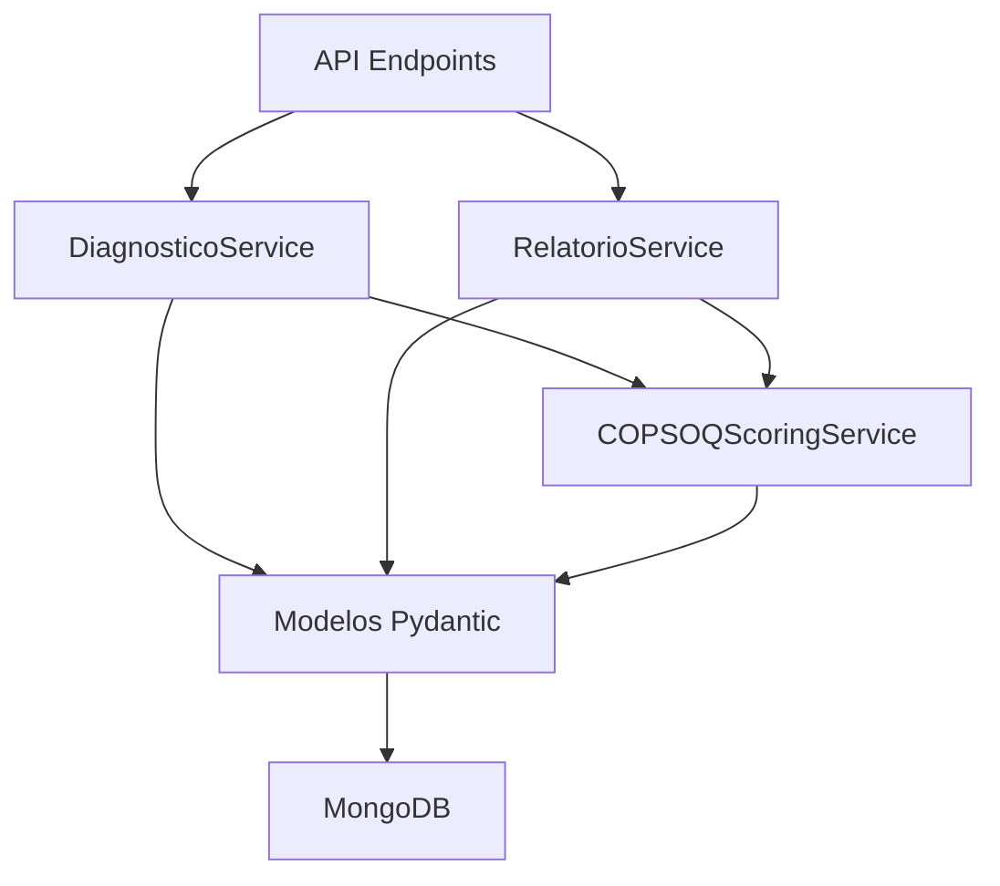
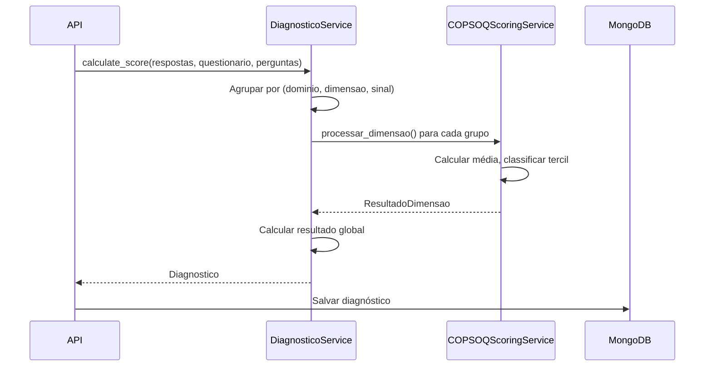
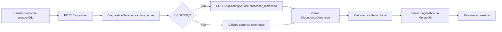
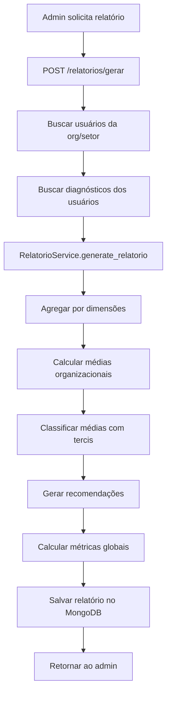

# Guia de Implementação COPSOQ II

> **Versão:** 2.1  
> **Última atualização:** 2026-02-07  
> **Status:** ✅ Implementado e Validado

## 📋 Índice

1. [Visão Geral](#visão-geral)
2. [Arquitetura da Solução](#arquitetura-da-solução)
3. [Serviços Implementados](#serviços-implementados)
4. [Modelos de Dados](#modelos-de-dados)
5. [Fluxo de Processamento](#fluxo-de-processamento)
6. [Geração de Insights e Relatórios](#geração-de-insights-e-relatórios)
7. [Exemplos de Uso](#exemplos-de-uso)
8. [Validação e Testes](#validação-e-testes)

---

## Visão Geral

O sistema LuzIA implementa o **COPSOQ II** (Copenhagen Psychosocial Questionnaire) para avaliação de riscos psicossociais no trabalho, suportando duas versões oficiais:

| Versão | Código | Idioma | Itens | Domínios | Dimensões |
|--------|--------|--------|-------|----------|-----------|
| **Curta Brasileira** | `COPSOQ_CURTA_BR` | pt-BR | 40 | 7 | 23 |
| **Média Portuguesa** | `COPSOQ_MEDIA_PT` | pt-PT | 76 | 8 | 29 |

### Características Principais

✅ **Classificação por Tercis** (verde/amarelo/vermelho)  
✅ **Suporte a Dimensões de Proteção vs Risco**  
✅ **Inversão Automática de Itens Específicos**  
✅ **Agregação Organizacional por Domínios**  
✅ **Geração de Recomendações Contextualizadas**  
✅ **Cálculo de Índices de Proteção**

---

## Arquitetura da Solução

### Camadas da Aplicação



### Responsabilidades

| Componente | Responsabilidade |
|------------|------------------|
| **COPSOQScoringService** | Lógica de scoring, classificação por tercis, inversão de itens |
| **DiagnosticoService** | Processamento de respostas individuais, cálculo de dimensões |
| **RelatorioService** | Agregação organizacional, geração de insights coletivos |
| **Modelos Pydantic** | Validação de dados, estrutura de diagnósticos e relatórios |

---

## Serviços Implementados

### 1. COPSOQScoringService

**Arquivo:** [`backend/src/app/services/copsoq_scoring_service.py`](file:///mnt/c/Users/ResTIC55/Desktop/LuzIA/LuzIA/backend/src/app/services/copsoq_scoring_service.py)

#### Métodos Principais

```python
class COPSOQScoringService:
    # Limites para classificação por tercis
    LIMITE_INFERIOR = 2.33
    LIMITE_SUPERIOR = 3.67
    
    def classificar_tercil(media: float, dimensao: str) -> ClassificacaoTercil
    def processar_dimensao(...) -> ResultadoDimensao
    def inverter_valor(valor: int, escala_max: int = 5) -> int
    def eh_dimensao_protecao(dimensao: str) -> bool
```

#### Classificação por Tercis

```python
# Dimensões de PROTEÇÃO (maior = melhor)
if media >= 3.67: FAVORÁVEL    # 🟢
elif media > 2.33: INTERMEDIÁRIO # 🟡  
else: RISCO                     # 🔴

# Dimensões de RISCO (menor = melhor)
if media <= 2.33: FAVORÁVEL     # 🟢
elif media < 3.67: INTERMEDIÁRIO # 🟡
else: RISCO                      # 🔴
```

#### Inversão de Itens

Apenas na versão **COPSOQ_MEDIA_PT**:
- `VLT_CV_03`: "A chefia esconde informação dos trabalhadores?"
- `VLT_CH_01`: "Os trabalhadores escondem informação uns dos outros?"

---

### 2. DiagnosticoService

**Arquivo:** [`backend/src/app/services/diagnostico_service.py`](file:///mnt/c/Users/ResTIC55/Desktop/LuzIA/LuzIA/backend/src/app/services/diagnostico_service.py)

#### Funcionalidades

✅ **Detecção Automática de Questionário COPSOQ**
```python
is_copsoq = codigo_questionario.startswith("COPSOQ_")
```

✅ **Integração com COPSOQScoringService**
```python
if is_copsoq:
    resultado = copsoq_scoring_service.processar_dimensao(
        dimensao=dimensao,
        dominio=dominio,
        respostas=items,
        codigo_questionario=codigo_questionario,
        escala_max=escala_max,
    )
```

✅ **Cálculo de Resultado Global**
```python
def _resultado_global(dimensoes: List[DiagnosticoDimensao]) -> Tuple[str, float]:
    # Baseado na distribuição de classificações
    if qtd_risco / total >= 0.5: return "risco"
    elif qtd_favoravel / total >= 0.5: return "favoravel"
    else: return "intermediario"
```

#### Fluxo de Processamento



---

### 3. RelatorioService

**Arquivo:** [`backend/src/app/services/relatorio_service.py`](file:///mnt/c/Users/ResTIC55/Desktop/LuzIA/LuzIA/backend/src/app/services/relatorio_service.py)

#### Funcionalidades

✅ **Agregação por Dimensões**
```python
# Agrupa diagnósticos por (codigo_dominio, dominio, dimensao, sinal)
agregacao_dimensoes: Dict[tuple, Dict[str, Any]] = {}
for diag in diagnosticos:
    for d in diag["dimensoes"]:
        # Calcula média organizacional
        # Conta distribuição (favoravel/intermediario/risco)
```

✅ **Cálculo de Métricas Organizacionais**
```python
# Média de Risco Global
risco_ratio = total_dim_risco / total_dim_classificadas
media_risco_global = risco_ratio * 4

# Índice de Proteção
indice_protecao = (total_dim_protecao_favoravel / total_dim_protecao) * 100
```

✅ **Geração de Recomendações**
```python
mapeamento = {
    "Exigências quantitativas": "Revisar distribuição de carga...",
    "Apoio social de superiores": "Implementar rotina de feedback...",
    "Burnout": "Criar plano de prevenção de esgotamento...",
    # ...
}
```

---

## Modelos de Dados

### DiagnosticoDimensao

```python
class DiagnosticoDimensao(BaseModel):
    dominio: str                      # Nome do domínio
    codigoDominio: Optional[str]      # Código (EL, OTC, RSL, etc.)
    dimensao: str                     # Nome da dimensão
    pontuacao: float                  # Média calculada (0-5 ou 0-4)
    classificacao: ClassificacaoTercil # favoravel/intermediario/risco
    sinal: str                        # "protecao" ou "risco"
    total_itens: int                  # Quantidade de perguntas
    itens_respondidos: int            # Perguntas respondidas
```

### RelatorioDimensao

```python
class RelatorioDimensao(BaseModel):
    dimensao: str                     # Nome da dimensão
    media: float                      # Média organizacional
    distribuicao: Dict[str, int]      # {"favoravel": 15, "intermediario": 8, "risco": 2}
    classificacao: ClassificacaoTercil # Classificação da média organizacional
    sinal: str                        # "protecao" ou "risco"
```

### RelatorioDominio

```python
class RelatorioDominio(BaseModel):
    codigo: str                           # Código do domínio (EL, OTC, etc.)
    nome: str                             # Nome do domínio
    dimensoes: List[RelatorioDimensao]    # Lista de dimensões agregadas
    media_dominio: float                  # Média do domínio
    classificacao_predominante: ClassificacaoTercil # Classificação mais comum
```

### Relatorio

```python
class Relatorio(BaseModel):
    idQuestionario: Any
    idOrganizacao: Optional[Any]
    idSetor: Optional[Any]
    tipoRelatorio: str                # "organizacional" ou "setorial"
    geradoPor: str                    # Quem gerou
    dataGeracao: datetime
    metricas: RelatorioMetricas       # Métricas agregadas
    dominios: List[RelatorioDominio]  # Agregação por domínios
    recomendacoes: List[str]          # Recomendações geradas
```

---

## Fluxo de Processamento

### 1. Diagnóstico Individual



### 2. Relatório Organizacional



---

## Geração de Insights e Relatórios

### Insights Individuais (Diagnóstico)

**Endpoint:** `GET /api/v1/diagnosticos/me`

**Exemplo de Resposta:**

```json
{
  "id": "507f1f77bcf86cd799439011",
  "anonId": "USR_1234567890",
  "resultadoGlobal": "intermediario",
  "pontuacaoGlobal": 2.15,
  "dimensoes": [
    {
      "dominio": "Exigências Laborais",
      "codigoDominio": "EL",
      "dimensao": "Exigências quantitativas",
      "pontuacao": 3.5,
      "classificacao": "intermediario",
      "sinal": "risco",
      "total_itens": 3,
      "itens_respondidos": 3
    },
    {
      "dominio": "Organização do Trabalho e Conteúdo",
      "codigoDominio": "OTC",
      "dimensao": "Influência no trabalho",
      "pontuacao": 2.0,
      "classificacao": "risco",
      "sinal": "protecao",
      "total_itens": 2,
      "itens_respondidos": 2
    }
  ]
}
```

### Insights Organizacionais (Relatório)

**Endpoint:** `POST /api/v1/relatorios/gerar`

**Exemplo de Resposta:**

```json
{
  "id": "507f1f77bcf86cd799439012",
  "tipoRelatorio": "organizacional",
  "metricas": {
    "mediaRiscoGlobal": 1.8,
    "indiceProtecao": 65.5,
    "totalRespondentes": 25
  },
  "dominios": [
    {
      "codigo": "EL",
      "nome": "Exigências Laborais",
      "media_dominio": 3.2,
      "classificacao_predominante": "intermediario",
      "dimensoes": [
        {
          "dimensao": "Exigências quantitativas",
          "media": 3.4,
          "classificacao": "intermediario",
          "sinal": "risco",
          "distribuicao": {
            "favoravel": 5,
            "intermediario": 15,
            "risco": 5
          }
        }
      ]
    }
  ],
  "recomendacoes": [
    "Revisar distribuição de carga de trabalho e prioridades."
  ]
}
```

### Gráficos Suportados

Com os dados estruturados do relatório, é possível gerar:

#### 1. Gráfico de Barras por Dimensão

```javascript
// Exemplo para frontend
const data = relatorio.dominios.flatMap(d => 
  d.dimensoes.map(dim => ({
    dimensao: dim.dimensao,
    media: dim.media,
    classificacao: dim.classificacao
  }))
);
```

#### 2. Gráfico de Radar por Domínio

```javascript
const radarData = relatorio.dominios.map(d => ({
  dominio: d.nome,
  media: d.media_dominio
}));
```

#### 3. Distribuição de Tercis (Stacked Bar)

```javascript
const stackedData = relatorio.dominios.flatMap(d =>
  d.dimensoes.map(dim => ({
    dimensao: dim.dimensao,
    favoravel: dim.distribuicao.favoravel,
    intermediario: dim.distribuicao.intermediario,
    risco: dim.distribuicao.risco
  }))
);
```

#### 4. Gráfico de Scorecard

```javascript
const scorecard = {
  mediaRiscoGlobal: relatorio.metricas.mediaRiscoGlobal,
  indiceProtecao: relatorio.metricas.indiceProtecao,
  totalRespondentes: relatorio.metricas.totalRespondentes
};
```

---

## Exemplos de Uso

### Exemplo 1: Processar Respostas COPSOQ

```python
from app.services.diagnostico_service import DiagnosticoService

service = DiagnosticoService()

respostas = [
    RespostaItem(idPergunta="EL_EQ_01A", valor=3),
    RespostaItem(idPergunta="EL_EQ_01B", valor=2),
    # ...
]

questionario = {
    "_id": ObjectId("..."),
    "codigo": "COPSOQ_CURTA_BR",
    "nome": "COPSOQ II - Versão Curta Brasileira"
}

perguntas = [
    {
        "idPergunta": "EL_EQ_01A",
        "dominio": "Exigências Laborais",
        "codigoDominio": "EL",
        "dimensao": "Exigências quantitativas",
        "sinal": "risco",
        "tipoEscala": "frequencia"
    },
    # ...
]

diagnostico = service.calculate_score(respostas, questionario, perguntas)
print(f"Resultado: {diagnostico.resultadoGlobal}")
print(f"Pontuação: {diagnostico.pontuacaoGlobal}")
```

### Exemplo 2: Gerar Relatório Organizacional

```python
from app.services.relatorio_service import RelatorioService

service = RelatorioService()

diagnosticos = [
    {
        "anonId": "USR_001",
        "dimensoes": [
            {
                "dominio": "Exigências Laborais",
                "codigoDominio": "EL",
                "dimensao": "Exigências quantitativas",
                "pontuacao": 3.5,
                "classificacao": "intermediario",
                "sinal": "risco"
            }
        ]
    },
    # ... mais diagnósticos
]

relatorio = service.generate_relatorio(
    diagnosticos=diagnosticos,
    questionario_id=ObjectId("..."),
    tipo="organizacional",
    org_id=ObjectId("..."),
    gerado_por="admin@empresa.com"
)

print(f"Respondentes: {relatorio.metricas.totalRespondentes}")
print(f"Índice de Proteção: {relatorio.metricas.indiceProtecao}%")
```

---

## Validação e Testes

### Testes Unitários

**Arquivo:** [`backend/tests/unit/test_copsoq_scoring.py`](file:///mnt/c/Users/ResTIC55/Desktop/LuzIA/LuzIA/backend/tests/unit/test_copsoq_scoring.py)

```bash
cd backend
pytest tests/unit/test_copsoq_scoring.py -v
```

### Testes de Integração

```bash
pytest tests/integration/test_diagnosticos_integration.py -v
pytest tests/integration/test_respostas_integration.py -v
```

### Validação Manual

#### 1. Verificar Classificação de Dimensões

```python
from app.services.copsoq_scoring_service import copsoq_scoring_service

# Dimensão de PROTEÇÃO
media = 2.5
classificacao = copsoq_scoring_service.classificar_tercil(media, "Influência no trabalho")
assert classificacao == "intermediario"

# Dimensão de RISCO
media = 2.5
classificacao = copsoq_scoring_service.classificar_tercil(media, "Exigências quantitativas")
assert classificacao == "intermediario"
```

#### 2. Verificar Inversão de Itens

```python
# Apenas na versão COPSOQ_MEDIA_PT
valor_original = 1
valor_invertido = copsoq_scoring_service.inverter_valor(valor_original, 5)
assert valor_invertido == 5
```

#### 3. Verificar Agregação de Relatório

```bash
# Criar diagnósticos de teste
curl -X POST http://localhost:8000/api/v1/respostas/ \
  -H "Content-Type: application/json" \
  -d @diagnostico_teste.json

# Gerar relatório
curl -X POST http://localhost:8000/api/v1/relatorios/gerar \
  -H "Content-Type: application/json" \
  -d '{
    "idQuestionario": "...",
    "idOrganizacao": "...",
    "tipo": "organizacional"
  }'

# Verificar estrutura de dominios[]
# Esperado: dominios[] com agregações por dimensão
```

---

## Checklist de Validação

- [x] COPSOQScoringService implementado com tercis corretos
- [x] DiagnosticoService usa COPSOQScoringService para COPSOQ
- [x] RelatorioService agrega por domínios e dimensões
- [x] Modelos RelatorioDominio e RelatorioDimensao criados
- [x] DiagnosticoDimensao contém campos completos
- [x] Inversão de itens funciona (VLT_CV_03, VLT_CH_01)
- [x] Dimensões de proteção classificadas inversamente
- [x] Recomendações geradas baseadas em dimensões em risco
- [x] Índice de proteção calculado corretamente
- [x] Distribuição de tercis incluída no relatório

---

## Referências

- [PLANO_COPSOQ_DATABASE_FINAL.md](file:///mnt/c/Users/ResTIC55/Desktop/LuzIA/LuzIA/docs/plans/PLANO_COPSOQ_DATABASE_FINAL.md)
- [copsoq_scoring_service.py](file:///mnt/c/Users/ResTIC55/Desktop/LuzIA/LuzIA/backend/src/app/services/copsoq_scoring_service.py)
- [diagnostico_service.py](file:///mnt/c/Users/ResTIC55/Desktop/LuzIA/LuzIA/backend/src/app/services/diagnostico_service.py)
- [relatorio_service.py](file:///mnt/c/Users/ResTIC55/Desktop/LuzIA/LuzIA/backend/src/app/services/relatorio_service.py)
- [base.py (Modelos)](file:///mnt/c/Users/ResTIC55/Desktop/LuzIA/LuzIA/backend/src/app/models/base.py)
- Manual COPSOQ II Versão Portuguesa
