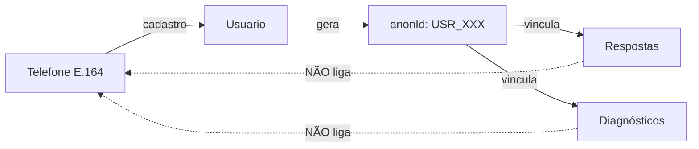

# Documentação de Segurança — LuzIA Backend

> **Voltar para:** [📚 Documentação](../README.md) | [🏛️ Arquitetura](../backend/ARQUITETURA.md)

---

## 1. Autenticação JWT

### Implementação
- **Arquivo**: [`backend/src/app/core/security.py`](../../backend/src/app/core/security.py)
- **Biblioteca**: `python-jose` com algoritmo HS256

### Características de Segurança

| Recurso | Descrição |
|---------|-----------|
| `SECRET_KEY` via `.env` | Chave nunca hardcoded no código |
| `jti` (JWT ID) | UUID único para cada token, permite revogação |
| `iat` (Issued At) | Timestamp de emissão para auditoria |
| `exp` obrigatório | Tokens expiram automaticamente |
| Timezone-aware | Usa `datetime.now(timezone.utc)` |

### Configuração

```env
SECRET_KEY=sua_chave_secreta_aqui  # Gere com: python3 -c "import secrets; print(secrets.token_urlsafe(32))"
ACCESS_TOKEN_EXPIRE_MINUTES=11520  # 8 dias (padrão)
```

---

## 2. Hashing de Senhas

### Implementação
- **Arquivo**: [`backend/src/app/core/security.py`](../../backend/src/app/core/security.py)
- **Algoritmo**: **PBKDF2-SHA256** via `passlib.CryptContext`
- **Iterações**: 29.000 (padrão do passlib)

```python
pwd_context = CryptContext(schemes=["pbkdf2_sha256"], deprecated="auto")
```

> **Nota:** `requirements.txt` lista `passlib[bcrypt]` como dependência (para ter bcrypt disponível como fallback), mas o código configurou explicitamente `pbkdf2_sha256` como scheme ativo.

---

## 3. Validação de Entrada

### Telefone (E.164)
- **Regex**: `^\+\d{10,15}$`
- **Arquivo**: [`backend/src/app/models/base.py`](../../backend/src/app/models/base.py)
- Obriga formato internacional com `+`

### Email
- **Regex**: `^[^@\s]+@[^@\s]+\.[^@\s]+$`
- **Arquivo**: [`backend/src/app/models/base.py`](../../backend/src/app/models/base.py)
- Normalizado para lowercase

### CNPJ
- **Validação completa** de dígitos verificadores
- **Arquivo**: [`backend/src/app/core/validators.py`](../../backend/src/app/core/validators.py)
- Rejeita CNPJs com todos os dígitos iguais

### Pydantic Models
- Validação automática de tipos em runtime
- `StatusEnum` para status de usuário (não aceita valores arbitrários)
- `RespostaItem` valida range 0-5 para valores numéricos

---

## 4. CORS (Cross-Origin Resource Sharing)

### Implementação
- **Arquivo**: [`backend/src/app/main.py`](../../backend/src/app/main.py)

### Configuração

```python
allow_origins=CORS_ORIGINS,       # Lista de domínios autorizados
allow_methods=["GET", "POST", "PUT", "DELETE", "OPTIONS"],
allow_headers=["Authorization", "Content-Type", "Accept"],
max_age=600,                      # Cache preflight por 10 minutos
```

### Origens Padrão

```env
# Desenvolvimento
CORS_ORIGINS=http://localhost:3000,http://localhost:8080

# Produção (Render)
CORS_ORIGINS=https://luz-ia-xi.vercel.app
```

---

## 5. Anonimização (LGPD)

### Implementação
- Cada usuário recebe um `anonId` único no cadastro
- Diagnósticos e respostas são vinculados ao `anonId`, **não** ao telefone/email
- Relatórios agregam dados anonimizados

### Fluxo de Dados



---

## 6. Proteção contra Injeção

### NoSQL Injection (MongoDB)
- Uso de Motor/PyMongo com queries parametrizadas
- Validação de tipos via Pydantic antes de queries
- `ObjectId` validado com try/except `InvalidId` antes de uso

### JWT Injection
- Biblioteca `python-jose` faz validação adequada
- Payload decodificado é validado antes de uso

---

## 7. Controle de Acesso

### Dependency Injection Chain

```python
get_token_user          # Extrai TokenData do header Authorization
    → get_current_user  # Carrega Usuario do banco
        → get_current_active_user  # Verifica is_active_user_status()
            → get_current_admin_user  # Verifica metadata.is_admin == True
```

**Arquivo**: [`backend/src/app/api/deps.py`](../../backend/src/app/api/deps.py)

---

## 8. Rate Limiting (Preparado)

### Hook Implementado

```python
async def check_rate_limit(identifier: str) -> bool:
    # TODO: Implementar com Redis
    return True
```

### Implementação Recomendada

```python
key = f"auth_attempts:{identifier}"
attempts = await redis.incr(key)
if attempts == 1:
    await redis.expire(key, 60)
return attempts <= 5
```

---

## 9. Validação Twilio Webhook

- **Configurável:** `TWILIO_VALIDATE_SIGNATURE=true`
- **Produção:** Valida assinatura do header `X-Twilio-Signature`
- **Desenvolvimento:** Validação desativada por padrão

---

## 10. Checklist de Segurança

| Item | Status | Arquivo |
|------|--------|---------|
| SECRET_KEY via env | ✅ | `core/config.py` |
| JWT com expiração | ✅ | `core/security.py` |
| JWT com jti (revogação) | ✅ | `core/security.py` |
| Hashing PBKDF2-SHA256 | ✅ | `core/security.py` |
| Validação telefone E.164 | ✅ | `models/base.py` |
| Validação email | ✅ | `models/base.py` |
| Validação CNPJ (dígitos) | ✅ | `core/validators.py` |
| StatusEnum (não string livre) | ✅ | `models/base.py` |
| CORS restritivo | ✅ | `main.py` |
| Anonimização (anonId) | ✅ | `models/base.py` |
| Twilio signature validation | ✅ | `bot/endpoints.py` |
| Rate Limiting | ⏳ Hook pronto | `core/security.py` |
| OTP Verification | ⏳ Hook pronto | `core/security.py` |
| HTTPS | ⚠️ Infraestrutura | Nginx/Load Balancer |
| Logs de auditoria | ⏳ Pendente | — |

---

## 11. Próximos Passos (Produção)

1. **Implementar Rate Limiting** com Redis
2. **Integrar Twilio Verify** para OTP real
3. **Adicionar logs de auditoria** (sem dados sensíveis)
4. **Configurar HTTPS** via Nginx ou Load Balancer
5. **Proteger rotas sensíveis** — já implementado via `Depends(get_current_admin_user)`

---

**Última Atualização:** 2026-02-16
